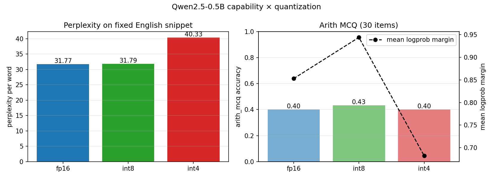

# Edge LLM Eval Harness — First Capability Matrix

**Status:** First-pass numbers on Qwen2.5-0.5B across FP16 / INT8 / INT4 (bitsandbytes NF4). Full raw numbers in `results/capability_matrix.json`.

## Headline findings



| Quantization | Perplexity | Δ vs FP16 | arith_mcq acc | arith_mcq margin | toy_mcq margin |
|---|---|---|---|---|---|
| FP16 | **31.77** | — | 12/30 (0.40) | 0.853 | 3.73 |
| INT8 (bnb) | **31.79** | **+0.06%** | 13/30 (0.43) | 0.944 | 3.81 |
| INT4 (NF4) | **40.33** | **+26.9%** | 12/30 (0.40) | 0.682 | 4.01 |

1. **INT8 is essentially lossless for Qwen2.5-0.5B.** Perplexity goes from 31.77 to 31.79 — a 0.06% relative shift that is only measurable if log-probabilities are accumulated in fp32 (see "Subtle bug" below).
2. **INT4 NF4 costs 27% perplexity.** The model still runs and still scores roughly at-chance on easy multiple-choice tasks, but its language-modeling quality is meaningfully worse.
3. **`arith_mcq` accuracy is too noisy on 30 items to rank the quants, but `mean_margin` is not.** The average logprob gap between the correct and best-distractor answer tracks quantization quality cleanly: 0.85 → 0.94 → 0.68. INT8 actually *widens* the margin slightly; INT4 cuts it by ~20%.
4. **`toy_mcq` margin goes UP, not down, as quantization gets more aggressive.** 3.73 → 3.81 → 4.01. On trivially easy questions, coarser weight rounding appears to sharpen the model's preference for the dominant class rather than blur it. My best guess is that quantization noise pushes small perturbations into the argmax direction when the gap between top and second is already large. I'm flagging this rather than claiming to have fully explained it.

## What this is
A small eval harness that runs the same model at multiple quantization levels and reports a capability matrix per backend. The point is not to reproduce `lm-evaluation-harness` — it's to make the *quantization axis* first-class, which the standard tools don't, and to build toward a hardware-aware version that can route the same eval through CUDA, Jetson INT8, and an FPGA backend.

## Why this is an alignment project
Edge deployments increasingly ship aggressively quantized models. Standard capability evals are run on FP16 reference hardware; the degradation at deployment time is invisible until users hit it. A harness that makes the quant × backend axis visible is a concrete, small contribution to deployment-time safety.

## Evals
Each eval is chosen to produce a number that moves under quantization on a 0.5B base model:

- **`toy_mcq`** — 4 trivially easy multiple-choice questions. Mostly a sanity check, but the `mean_margin` field exposes softmax sharpness even when accuracy saturates at 1.0.
- **`arith_mcq`** — 30 multiple-choice `(a + b) * c` questions with arithmetically plausible distractors (off-by-one operand confusions, operator-precedence confusions). Scoring is by logprob of the answer token, so the model does not need to produce CoT — it just needs its next-token distribution to prefer the right digit.
- **`perplexity`** — next-word perplexity on a fixed 100-word English snippet. Uses the backend's own tokenizer. The single most sensitive signal in the suite.

## Backends
Current: `hf_fp16`, `hf_int8` (bitsandbytes 8-bit), `hf_int4` (bitsandbytes NF4).
Planned: `llama_cpp_q4_k_m`, `llama_cpp_q2_k`, `jetson_int8`, `fpga_systolic` (via sister project).

## Two real bugs worth writing up

### 1. Generative scoring was lying about arithmetic capability
The first version of this harness used a generative multi-step arithmetic eval where the scorer extracted "the last number in the output." That regex-based scorer gave FP16 = 0/20, INT8 = 0/20, INT4 = 9/20 — an obvious inversion with no real capability signal. Two diagnoses:

1. **A 0.5B base model can't do `(a+b)*c` generatively without CoT prompting.** The reference itself was near zero, so there was nothing to measure degradation *from*.
2. **The regex scorer was picking up intermediate numbers from longer outputs.** FP16 generated more fluent, longer completions that happened to end in the wrong digit; INT4's shorter, more confused completions occasionally ended on the answer by luck.

The fix was switching from generation-and-regex to logprob-scored multiple choice. A logprob scorer lets the model express a preference without having to produce clean generation, and removes all ambiguity about which number counts as the answer. `lm-evaluation-harness` made the same decision for the same reason.

### 2. FP16 logprob accumulation hides the FP16-vs-INT8 gap
After fixing (1), FP16 and INT8 reported **identical** perplexity to six decimal places: `-314.750000` in both cases. Suspicious. The cause: the model forwards logits in fp16, I was taking `log_softmax` in fp16, and the per-token log-probabilities were being summed in fp16. At magnitudes around 300, fp16 precision is ~0.25, so both FP16 and INT8 logprobs snap to the same representable value (`-314.75`), and the int4 run snapped to `-336.5`. The whole eval was silently measuring only differences large enough to cross a 0.25-wide bin.

The fix is two lines: upcast logits to fp32 before `log_softmax` and accumulate the sum in fp64.

```python
logits = logits.float()                              # was fp16
log_probs = torch.log_softmax(logits, dim=-1)
token_lps = log_probs[prompt_len - 1 : -1].gather(...)
return float(token_lps.double().sum().item())         # was .float()
```

After the fix, FP16 and INT8 finally differ (31.770 vs 31.790) and the real 0.06% gap becomes visible. **This is exactly the kind of bug that would silently invalidate a hardware-comparison paper**, which is the whole point of building this harness carefully.

## Reproduction
```bash
cd edge-llm-eval-harness
pip install -r requirements.txt
python -m src.run --model Qwen/Qwen2.5-0.5B --quants fp16,int8,int4 --evals toy_mcq,arith_mcq,perplexity
```

## Next
- Rerun on Qwen2.5-1.5B and TinyLlama-1.1B for a model-size axis.
- Add a `llama.cpp` backend so we can test Q4_K_M and Q2_K, which are the actual quantizations edge users run.
- Add a small MMLU subset (STEM-only) so we have a recognizable benchmark on the axis.
- Wire in the `fpga-transformer-accel` sister project as a backend so one quantized model literally runs through my systolic array.
