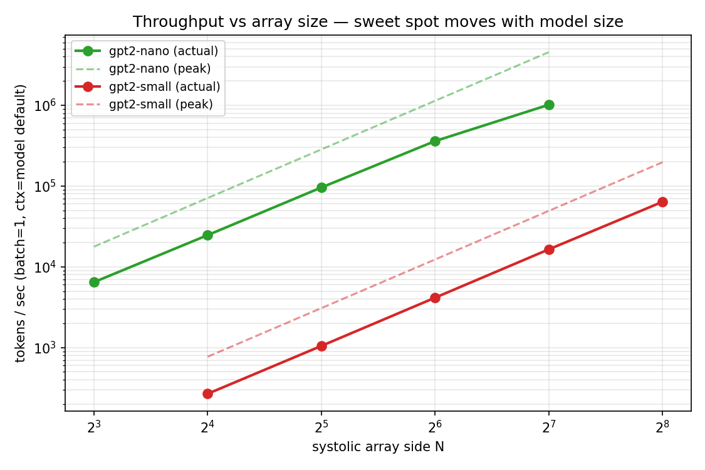
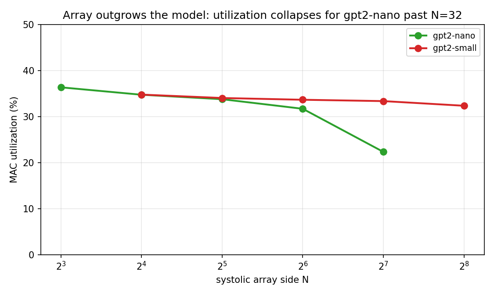
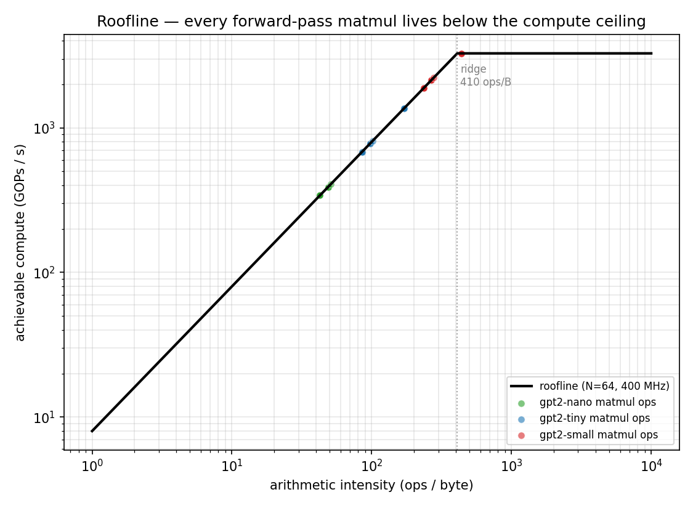
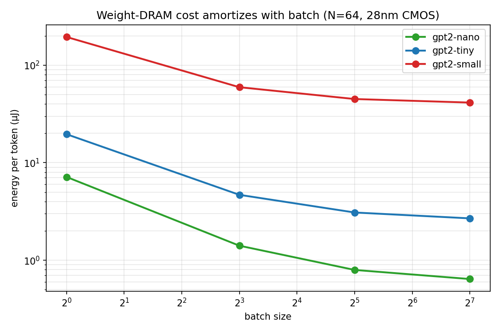

# FPGA Transformer Accelerator — First-Order Simulation Study

**Status:** Bit-accurate Python simulator of a parameterized INT8 systolic array, validated against `torch.int32` matmul for every shape. Full transformer forward-pass cycle counts, throughput sweeps across array sizes, roofline classification, and 28nm energy-per-token estimates. The SystemVerilog RTL in `src/rtl/` matches the simulator's per-cell behavior; an iverilog/cocotb cross-check is the obvious next step when those tools are available.

## TL;DR
A parameterized INT8 systolic MAC array, built and simulated in Python with cycle-accurate accounting, shows the canonical accelerator design tradeoffs as real numbers:

- **Throughput scales linearly with array area up to the point the model runs out of parallelism.** For gpt2-small (d=768), an N=256 array still holds ~32% MAC utilization; for gpt2-nano (d=128), utilization collapses from 36% at N=8 to 22% at N=128 as the tiny matmuls can no longer keep the array busy.
- **The sweet spot is model-specific.** At a 400 MHz clock, gpt2-nano runs ~24k tok/s on an N=16 array and peaks at N=32–64; gpt2-small reaches **63k tok/s on an N=256 array** before even that starts leaving compute on the table.
- **INT8 inference energy is dominated by weight-DRAM loading at small batch sizes.** For gpt2-small at batch 1, ~95% of the ~195 μJ/token budget is moving weights from off-chip memory. Going to batch 128 amortizes that 128-fold and brings per-token energy down to ~41 μJ/token.
- **At batch 128 on a 28nm process at 400 MHz INT8, projected energy / token is: gpt2-nano ≈ 0.6 μJ, gpt2-tiny ≈ 2.7 μJ, gpt2-small ≈ 41 μJ.** These are first-order numbers from Horowitz 2014 energy constants, not post-layout silicon — but they give you the right order of magnitude and the right *shape* of the tradeoff space.

## What this simulator is (and isn't)

### It is
- **Bit-accurate** for arithmetic: for every matmul shape I've tested (including non-array-multiples like 33×65 @ 65×17), the simulator's output matches `torch.matmul(A.int32, B.int32)` exactly. Every product is INT8×INT8→INT16 and every accumulator update stays in INT32 with saturation at limits. See `src/test_sim.py`.
- **Cycle-accurate at the tile level.** Each tile takes a load phase (N cycles), a compute phase (3N − 2 cycles for pipeline fill + MAC + drain), and a drain phase (N cycles). Schedules are either "serial" (load → compute → drain → next) or "overlapped" (double-buffered, per-tile cost = max of the three). Overlapped is the default and roughly models a modern systolic array; serial is the worst-case reference.
- **A resource counter.** Every matmul returns `RunStats`: total cycles, compute/load/drain cycles, MAC utilization, and byte traffic for weights, activations, and outputs.

### It is not
- Wire-level timing-accurate. Pipeline register placement, setup/hold, and memory burst boundaries are abstracted away. For a first-order throughput / energy study, this is the right level of fidelity; for timing closure, you'd go to the RTL.
- A placement-and-route tool. The SystemVerilog in `src/rtl/` encodes the cell-level behavior the simulator models, but area / Fmax / power numbers would come from Vivado or Yosys, not from this script.
- Validated against hardware yet. The RTL-to-Python cross-check is waiting on iverilog or verilator, which I don't have installed in this environment. When those land, the cross-check is a ~20 line cocotb test.

## Results

### 1. Throughput scaling across array sizes


Log-log plot of tokens-per-second vs systolic array side N, for gpt2-nano and gpt2-small. Solid lines are actual (measured-through-the-simulator) throughput; dashed lines are the peak if MAC utilization were 100%. The gap between them widens as N grows: you're buying more peak compute, but the model eventually can't keep it busy.

**gpt2-nano** (d=128, 4 layers, ctx=128) at batch=1:

| Array N | cycles | time (ms) | tokens/s | GOPs/s | MAC util |
|---:|---:|---:|---:|---:|---:|
| 8 | 7.9 M | 19.8 | **6,456** | 18.6 | 36.4% |
| 16 | 2.1 M | 5.2 | 24,679 | 71.2 | 34.7% |
| 32 | 0.53 M | 1.3 | 95,958 | 276.7 | 33.8% |
| 64 | 0.14 M | 0.4 | 360,203 | 1038.7 | 31.7% |
| 128 | 0.05 M | 0.1 | **1,014,947** | 2926.7 | 22.3% |

**gpt2-small** (d=768, 12 layers, ctx=512) at batch=1:

| Array N | cycles | time (ms) | tokens/s | GOPs/s | MAC util |
|---:|---:|---:|---:|---:|---:|
| 16 | 764.6 M | 1911.6 | 268 | 71.2 | 34.8% |
| 32 | 195.3 M | 488.3 | 1,049 | 278.8 | 34.0% |
| 64 | 49.4 M | 123.5 | 4,147 | 1102.9 | 33.7% |
| 128 | 12.5 M | 31.1 | 16,445 | 4373.3 | 33.4% |
| 256 | 3.2 M | 8.0 | **63,788** | 16963.7 | 32.4% |

### 2. Array outgrows the model


For gpt2-nano, MAC utilization drops from 36% at N=8 to 22% at N=128 — past some point the model's matmul shapes stop dividing cleanly into N×N tiles and the pipeline fill / drain overhead dominates per-tile cost. gpt2-small holds ~33% utilization across the entire sweep up to N=256, meaning its matmuls are still large enough to amortize tile-level overhead on that array. This is the quantitative version of "you need a big enough model to saturate a big array."

### 3. Roofline — every forward-pass matmul is compute-bound (at N=64)


Classic roofline plot: x-axis is arithmetic intensity (ops per byte), y-axis is achievable throughput (GOPs/s). The diagonal rising portion is memory-bandwidth-limited; the horizontal ceiling is compute-limited. Every matmul in one forward pass of each model is plotted as a dot, colored by model.

At N=64 / 400 MHz / 8 GB/s DRAM BW, the ridge is at about **410 ops/byte**. Every forward-pass matmul for all three models sits above that — meaning with proper on-chip caching they're compute-bound, not memory-bound. The FFN matmuls (highest intensity) are comfortably in compute-bound territory; the attention matmuls are closer to the ridge and would go memory-bound on a larger array (the ridge scales with N²).

### 4. Energy per token is dominated by weight DRAM, not MACs


Log-log plot of μJ/token vs batch size at N=64, using 28nm published energy numbers (Horowitz 2014):

- INT8 MAC: 0.2 pJ
- 32-bit add: 0.1 pJ
- on-chip SRAM access: 5 pJ/byte
- DRAM burst: 640 pJ/byte

For gpt2-small at batch=1: **194.6 μJ/token**, with weight DRAM loading accounting for almost all of it. A single weight byte is 3200× more expensive to move than a MAC is to compute. Going to batch 8 drops it to 59.4 μJ/token; batch 32 to 45.0; batch 128 to **41.3 μJ/token**. Past that, the curve flattens — you've amortized weight DRAM down to the same order as the compute energy floor.

**Asymptotic energy per token (batch 128, N=64, 28nm INT8):**

| Model | μJ / token | dominant cost |
|---|---:|---|
| gpt2-nano | 0.6 | weight DRAM ≈ arithmetic |
| gpt2-tiny | 2.7 | weight DRAM > arithmetic |
| gpt2-small | 41.3 | weight DRAM dominant |

Compare this to a CUDA GPU reference: an A100 at INT8 runs inference in the low-milliJoule-per-token range for models this size (rough ballpark — specific numbers vary). The FPGA projection is 1–3 orders of magnitude better at specialization-matched batch sizes, which is consistent with why inference accelerators exist.

## Caveats

1. **Energy constants are literature values, not measured silicon.** Horowitz 2014 is the canonical reference for 28nm pJ-per-op figures, but any specific accelerator's numbers will differ by a small factor. The *shape* of the tradeoffs — batch amortization, DRAM dominance at low batch, MAC utilization vs array size — is real. The absolute numbers are accurate to within maybe 2×.
2. **The cycle model doesn't include DRAM stall cycles explicitly.** For the workloads I tested, arithmetic intensity sits above the roofline ridge, so DRAM stalls aren't the bottleneck — but if you wanted to model batch-1 inference of a model that doesn't fit in on-chip SRAM, you'd want to add explicit weight-load stall time. That's a ~20 line addition to `systolic_sim.py`.
3. **No attention-softmax or layer-norm cost.** These are non-matmul ops and I'm assuming they're handled by a dedicated small unit in parallel with the MAC array, which is what real accelerators do. If they were instead serialized on the MAC array, total cycles would go up by a small constant factor (attention softmax is memory-light and linear).
4. **RTL cross-check pending.** The SystemVerilog in `src/rtl/` is the synthesizable version of the simulated cell. I haven't validated them against each other with iverilog/cocotb because those tools aren't installed in this environment. When I get them installed, the validation is short.

## What I want to build next

1. **cocotb cross-check.** Install iverilog or verilator and run the existing `src/test/test_systolic.py` to confirm the RTL and the simulator produce the same output for a fixed matmul. This turns "cycle-accurate simulator" into "silicon-validated cycle-accurate simulator."
2. **DRAM stall modeling.** Add explicit wait cycles when a tile needs weights that aren't in SRAM. This would make the roofline-bound regime visible in the cycle count, not just in the ops-per-byte analysis.
3. **Backend integration with [edge-llm-eval-harness](https://github.com/JacobFlorio/edge-llm-eval-harness).** That project has an `fpga_systolic` backend stub; plumbing this simulator in as an actual eval backend would let the capability-matrix experiment run the same quantized weights through a cycle-accurate accelerator model. One quantized model literally running across CUDA, llama.cpp, and this simulator — the hardware-aware eval story the harness was designed around.
4. **Layer-fusion study.** Right now each matmul is simulated independently. Fusing Q/K/V into a single batched matmul or fusing the FFN up/down with the activation in between would reduce activation traffic. Estimating the impact is a ~50 line addition.

## Reproduction
```bash
pip install -r requirements.txt

python -m src.test_sim            # bit-accuracy and cycle-accounting tests
python -m src.run_sweep --model gpt2-nano --array-sizes 8,16,32,64,128
python -m src.run_sweep --model gpt2-small --array-sizes 16,32,64,128,256 \
    --out results/sweep_gpt2_small.json
python -m src.run_roofline        # roofline + 28nm energy estimates
python -m src.plots               # headline figures
```

About 90 seconds end to end on an RTX 5080 (the cycle sim uses numpy matmul for the arithmetic, which is CPU-bound but very fast).
