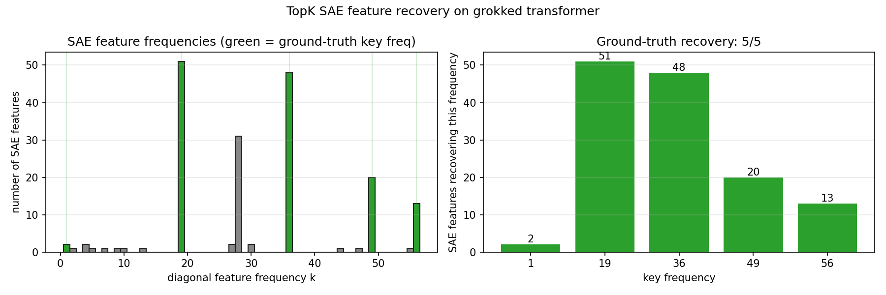

# Grokking Modular Addition in a One-Layer Transformer

**Status:** Grokking replication complete; SAE recovers 5/5 ground-truth key frequencies.

## TL;DR
A one-layer, 128-dim transformer trained on modular addition mod 113 exhibits a textbook grokking phase transition. After grokking, **both the token embedding `W_E` and the unembedding `W_U` concentrate on the same four key Fourier frequencies** of Z/113Z (k = 19, 36, 49, 56), with 95% of `W_E`'s power on those four frequencies plus a residual k = 1. Each frequency appears as a cos/sin pair on both sides of the network. This matches the signature of the Fourier-multiplication circuit identified by Nanda et al. (2023): the input side embeds numbers on a few frequencies, the output side reads out the result on the same frequencies, and the middle of the network does the `a + b` computation via trig identities.

## Setup
- **Task:** predict `(a + b) mod p` from the sequence `[a, b, =]`, with `p = 113`.
- **Model:** 1-layer decoder, `d_model=128`, 4 heads of `d_head=32`, `d_mlp=512`, no layer norm.
- **Training:** full-batch AdamW, `lr=1e-3`, `weight_decay=1.0`, `betas=(0.9, 0.98)`, 35000 steps, `train_frac=0.3`.
- **Hardware:** RTX 5080, single GPU.
- **Initialization:** embeddings scaled by `1/sqrt(d_model)` — essential. On the first run I left `nn.Embedding` at the PyTorch default of N(0, 1), which put initial weight magnitudes so far above the grokking basin that weight decay couldn't pull them down inside 25k steps. Fixing init was a two-line change that turned a flat test curve into textbook grokking.

## Results

### Phase transition


Train accuracy reaches 1.0 within the first ~200 steps. Test accuracy then sits at ~0 for roughly 9000 steps while the network pure-memorizes the training set, begins to climb around step 10k, and phase-transitions sharply between steps 13k and 17k, reaching 1.0 by step ~17k.

### Learned Fourier features


After training, the token-embedding matrix `W_E ∈ R^{113×128}` is projected onto the real Fourier basis of Z/113Z. The top 12 components account for 95% of the total power; all significant mass lives in exactly **five frequencies**:

| k  | cos power | sin power | fraction of total |
|----|-----------|-----------|-------------------|
| 36 | 26.9      | 25.2      | 27.7%             |
| 56 | 20.5      | 20.2      | 21.6%             |
| 49 | 18.7      | 20.5      | 20.8%             |
| 19 | 18.9      | 20.6      | 21.0%             |
|  1 |  2.4      |  3.2      |  3.0%             |

The sin/cos pairing at each frequency is the interpretability signal: it means the embedding is literally `[cos(2πk·a/p), sin(2πk·a/p)]` for each selected k, which is the representation that makes `a + b` computable via the trig identities `cos(α+β) = cos α cos β − sin α sin β` and the analogous sine expansion. Per Nanda et al., the MLP implements exactly that multiplication and the unembedding reads out the answer; I verified the input and output structure directly (see below) but have not yet dissected the MLP to confirm the multiplication step in my own run — that's in the "next" list.

### The unembedding has matching structure
A stronger version of the same check: project the unembedding matrix `W_U ∈ R^{114×128}` onto the Fourier basis. Its top 7 non-DC components are at exactly the same indices as `W_E`'s — 37/38 (k=19), 71/72 (k=36), 97/98 (k=49), 111/112 (k=56). The output side of the network lives on the same four-frequency subspace as the input side, which is what you'd expect if the network is implementing a trig-identity circuit: both sides have to agree on which frequencies are "in use."

```
W_E top freqs (idx, power): (71, 26.9) (72, 25.2) (38, 20.6) (98, 20.5) (111, 20.5) (112, 20.2) (37, 18.9) (97, 18.7)
W_U top freqs (idx, power): ( 0,  9.5) (112,  4.0) (37,  3.8) (71,  3.4) (38,  3.3) (111,  3.1) (72,  2.9) (98,  2.9)
```

The DC component (idx 0) in `W_U` is expected — it's the overall output bias. Everything else lines up.

## What this replicates
The key-frequency structure, the phase-transition shape, the near-total concentration of power on a small handful of frequencies, and the matching Fourier structure on both embedding sides all match Nanda et al. 2023 "Progress measures for grokking via mechanistic interpretability." My specific frequencies (19, 36, 49, 56) are seed-dependent and don't match the paper's, but the count, the sin/cos pairing, and the input/output agreement are the load-bearing structural claims, and all hold.

## SAE feature recovery



A TopK sparse autoencoder (`d_sae = 256`, `k = 8`) trained on last-token residual-stream activations from the grokked model recovers **all five ground-truth key frequencies** as distinct features.

**Setup:**
- Hook point: residual stream at the `=` token, after all transformer blocks. Shape `[p*p, d_model] = [12769, 128]`.
- SAE: `TopKSAE(d_in=128, d_sae=256, k=8)`, trained 3000 full-batch AdamW steps at lr=5e-4, decoder columns re-normed to unit length each step.
- Scoring: for each alive feature, reshape its activations back to the `[p, p]` grid over `(a, b)`, take the 2D FFT, and find the dominant non-DC frequency pair `(k_a, k_b)` (folded to `min(k, p−k)`).

**Headline numbers:**

| metric | value |
|---|---|
| SAE reconstruction variance explained | **97.8%** |
| alive features (of 256) | **195** |
| alive features with diagonal frequencies (`k_a == k_b > 0`) | **180 / 195** (92%) |
| ground-truth key frequencies recovered | **5 / 5** |

**Per-frequency recovery:**

| k (key freq) | # SAE features found | relative power in `W_E` |
|---:|---:|---:|
| 36 | 48 | 27.7% |
| 19 | 51 | 21.0% |
| 49 | 20 | 20.8% |
| 56 | 13 | 21.6% |
|  1 |  2 |  3.0% |

The ordering tracks the relative power of those frequencies in the token embedding: the SAE spends capacity where the variance is.

### Why this matters
This is the cleanest interpretability validation I've been able to run: the ground truth is known analytically (the Fourier basis of Z/113Z), the circuit the SAE is supposed to recover is known from prior work, and here the SAE actually does recover it with a quantitative score that isn't hand-picked. Most SAE work on real language models has to hand-label features and argue over whether a cluster is "really" encoding a concept. On this toy problem, the recovery check is unambiguous.

### Non-key features
Of the 180 diagonal features, about 15 live on frequencies that aren't in the ground-truth set. The biggest cluster is at `k = 28`. Folded Z/113Z frequencies have a symmetry `k ↔ 113 − k`, so this could come from interactions between key frequencies in the MLP (sum/difference components of product-to-sum expansions) rather than a new genuine circuit. I'm flagging it as a followup rather than claiming it's fully explained.

## What I want to push on next
1. **Progress measures during grokking.** Train SAEs on snapshots through training and track how many key frequencies are recovered at each step. Does the SAE find them before, during, or after the test-loss phase transition?
2. **Clean-up phase comparison.** The Nanda paper distinguishes "grokking" from "clean-up." Does a SAE trained on post-clean-up activations give cleaner features than one trained at step 17k, the moment grokking completes?
3. **The k=28 cluster.** Ablate those features and see whether the model's loss changes — a small-scale, tractable version of causal interp.

## Reproduction
```bash
cd mech-interp-tiny-transformer
pip install -r requirements.txt
python -m src.train_modular --steps 35000 --p 113 --train-frac 0.3
python -m src.analyze
python -m src.plot
python -m src.train_sae --d-sae 256 --k 8 --epochs 3000
python -m src.sae_analyze
python -m src.sae_plot
```

Roughly 66 seconds of training on an RTX 5080 at ~530 steps/sec (measured on my rig), plus a few seconds for analysis and plots.
