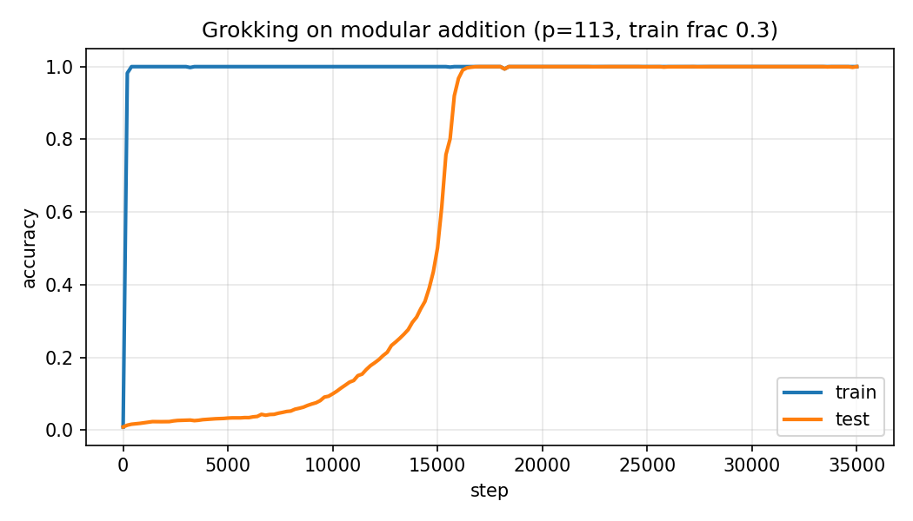
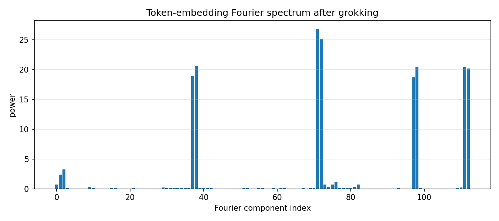

# Grokking Modular Addition in a One-Layer Transformer

**Status:** First-pass replication complete. Next: SAE feature recovery.

## TL;DR
A one-layer, 128-dim transformer trained on modular addition mod 113 exhibits a textbook grokking phase transition. After grokking, **both the token embedding `W_E` and the unembedding `W_U` concentrate on the same four key Fourier frequencies** of Z/113Z (k = 19, 36, 49, 56), with 95% of `W_E`'s power on those four frequencies plus a residual k = 1. Each frequency appears as a cos/sin pair on both sides of the network. This matches the signature of the Fourier-multiplication circuit identified by Nanda et al. (2023): the input side embeds numbers on a few frequencies, the output side reads out the result on the same frequencies, and the middle of the network does the `a + b` computation via trig identities.

## Setup
- **Task:** predict `(a + b) mod p` from the sequence `[a, b, =]`, with `p = 113`.
- **Model:** 1-layer decoder, `d_model=128`, 4 heads of `d_head=32`, `d_mlp=512`, no layer norm.
- **Training:** full-batch AdamW, `lr=1e-3`, `weight_decay=1.0`, `betas=(0.9, 0.98)`, 35000 steps, `train_frac=0.3`.
- **Hardware:** RTX 5080, single GPU.
- **Initialization:** embeddings scaled by `1/sqrt(d_model)` — essential. On the first run I left `nn.Embedding` at the PyTorch default of N(0, 1), which put initial weight magnitudes so far above the grokking basin that weight decay couldn't pull them down inside 25k steps. Fixing init was a two-line change that turned a flat test curve into textbook grokking.

## Results

### Phase transition


Train accuracy reaches 1.0 within the first ~200 steps. Test accuracy then sits at ~0 for roughly 9000 steps while the network pure-memorizes the training set, begins to climb around step 10k, and phase-transitions sharply between steps 13k and 17k, reaching 1.0 by step ~17k.

### Learned Fourier features


After training, the token-embedding matrix `W_E ∈ R^{113×128}` is projected onto the real Fourier basis of Z/113Z. The top 12 components account for 95% of the total power; all significant mass lives in exactly **five frequencies**:

| k  | cos power | sin power | fraction of total |
|----|-----------|-----------|-------------------|
| 36 | 26.9      | 25.2      | 27.7%             |
| 56 | 20.5      | 20.2      | 21.6%             |
| 49 | 18.7      | 20.5      | 20.8%             |
| 19 | 18.9      | 20.6      | 21.0%             |
|  1 |  2.4      |  3.2      |  3.0%             |

The sin/cos pairing at each frequency is the interpretability signal: it means the embedding is literally `[cos(2πk·a/p), sin(2πk·a/p)]` for each selected k, which is the representation that makes `a + b` computable via the trig identities `cos(α+β) = cos α cos β − sin α sin β` and the analogous sine expansion. Per Nanda et al., the MLP implements exactly that multiplication and the unembedding reads out the answer; I verified the input and output structure directly (see below) but have not yet dissected the MLP to confirm the multiplication step in my own run — that's in the "next" list.

### The unembedding has matching structure
A stronger version of the same check: project the unembedding matrix `W_U ∈ R^{114×128}` onto the Fourier basis. Its top 7 non-DC components are at exactly the same indices as `W_E`'s — 37/38 (k=19), 71/72 (k=36), 97/98 (k=49), 111/112 (k=56). The output side of the network lives on the same four-frequency subspace as the input side, which is what you'd expect if the network is implementing a trig-identity circuit: both sides have to agree on which frequencies are "in use."

```
W_E top freqs (idx, power): (71, 26.9) (72, 25.2) (38, 20.6) (98, 20.5) (111, 20.5) (112, 20.2) (37, 18.9) (97, 18.7)
W_U top freqs (idx, power): ( 0,  9.5) (112,  4.0) (37,  3.8) (71,  3.4) (38,  3.3) (111,  3.1) (72,  2.9) (98,  2.9)
```

The DC component (idx 0) in `W_U` is expected — it's the overall output bias. Everything else lines up.

## What this replicates
The key-frequency structure, the phase-transition shape, the near-total concentration of power on a small handful of frequencies, and the matching Fourier structure on both embedding sides all match Nanda et al. 2023 "Progress measures for grokking via mechanistic interpretability." My specific frequencies (19, 36, 49, 56) are seed-dependent and don't match the paper's, but the count, the sin/cos pairing, and the input/output agreement are the load-bearing structural claims, and all hold.

## What I want to push on next
1. **SAE feature recovery.** Train a TopK sparse autoencoder on residual-stream activations at step 17k (just after grokking) and at step 35k (after clean-up). Score each SAE feature against the known Fourier ground truth — which frequencies does the SAE recover, and does it recover more of them after clean-up?
2. **Progress measures.** Track Fourier power concentration as a training-time metric. Does it rise smoothly during the memorization plateau (hidden progress) or jump at the same step the test curve jumps?
3. **Circuit crystallization timing.** At what step does each individual frequency first appear in `W_E`? Is it all at once, or staggered?

## Reproduction
```bash
cd mech-interp-tiny-transformer
pip install -r requirements.txt
python -m src.train_modular --steps 35000 --p 113 --train-frac 0.3
python -m src.analyze
python -m src.plot
```

Roughly 66 seconds of training on an RTX 5080 at ~530 steps/sec (measured on my rig), plus a few seconds for analysis and plots.
